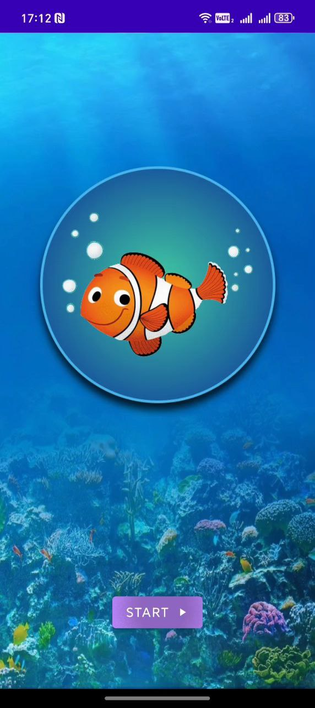
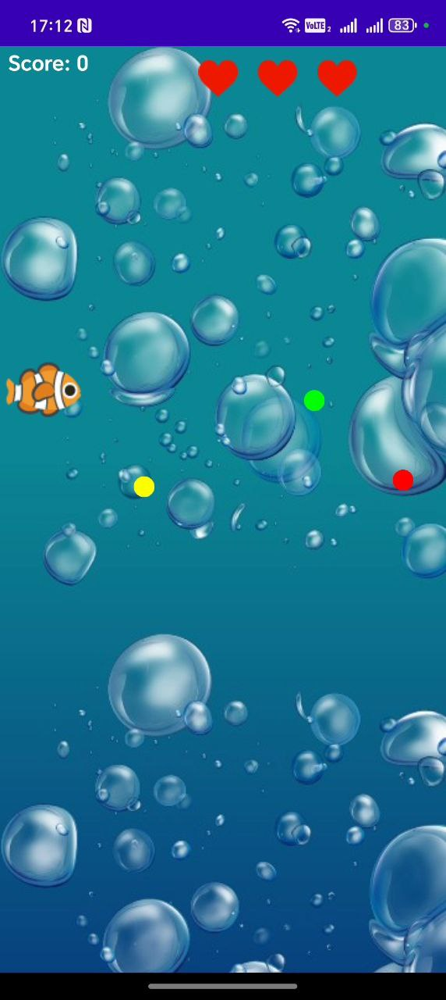

# 🐟 Fish Survival

Simple and addictive Android arcade game built in Java.

---

## 🎮 Gameplay

Control your fish and survive as long as possible!

Collect points, avoid danger, and try to beat your high score.

---

## 📱 Screenshots

### 🏁 Start Screen

### 🎮 Gameplay

---

## ✨ Features

- Smooth touch controls
- Score counter
- High score tracking
- Life system (3 hearts ❤️)
- Underwater theme
- Lightweight & fast

---

## 📦 Download APK

👉 [Download Latest Version](https://github.com/arakel-programs/FeedtheFish/releases/download/v1.0.0/app-release.apk)

Or download directly from the Releases section.

---

## 🛠 Built With

- Java
- Android SDK
- Gradle

---

## 👨‍💻 Developer

**Gor Arakelyan**  
Full-Stack & Game Developer  

- GitHub: https://github.com/arakel-programs
- Email: arakel.programs@gmail.com

---

## 📄 License

This project is for educational and portfolio purposes.
